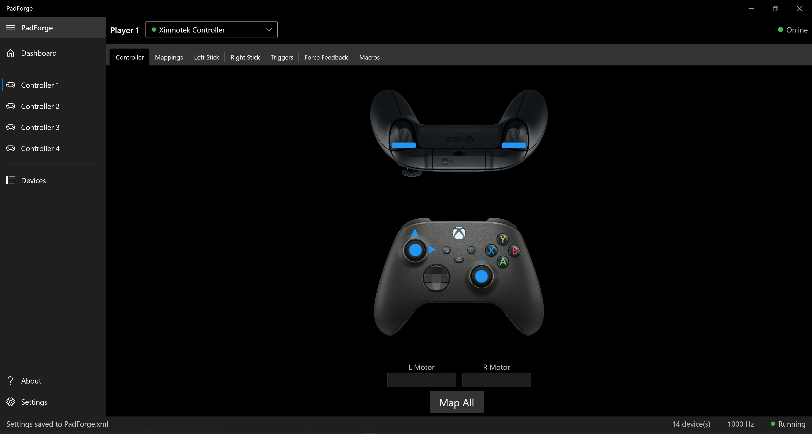
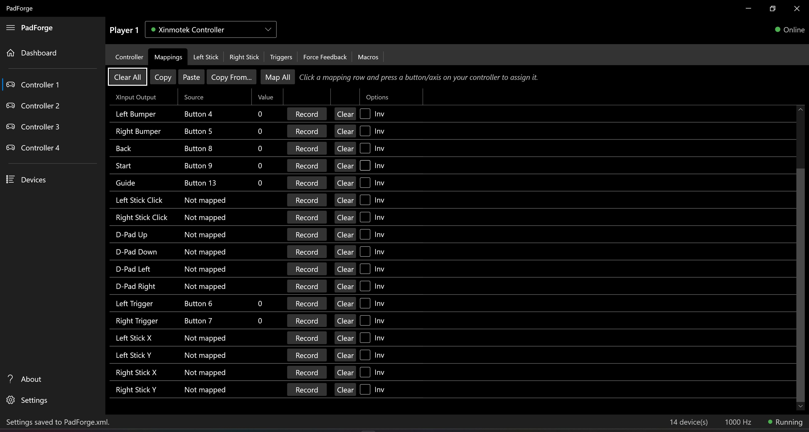
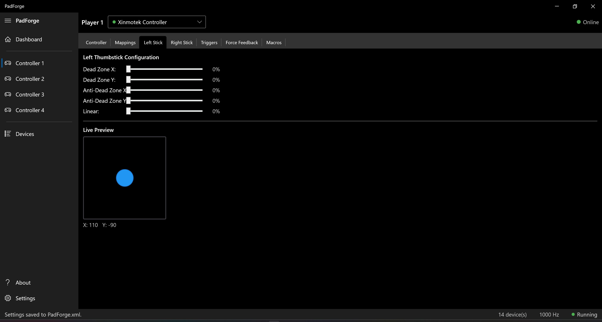
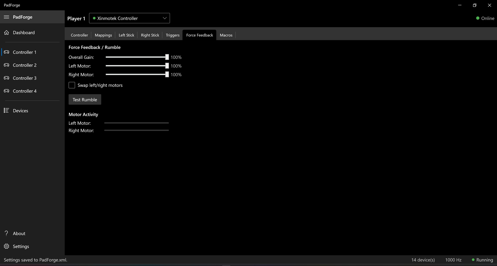
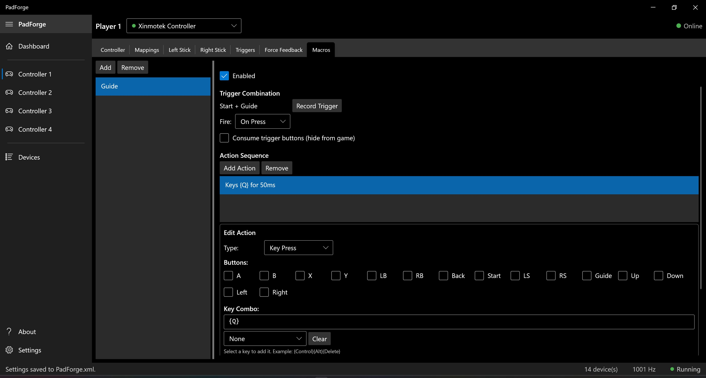
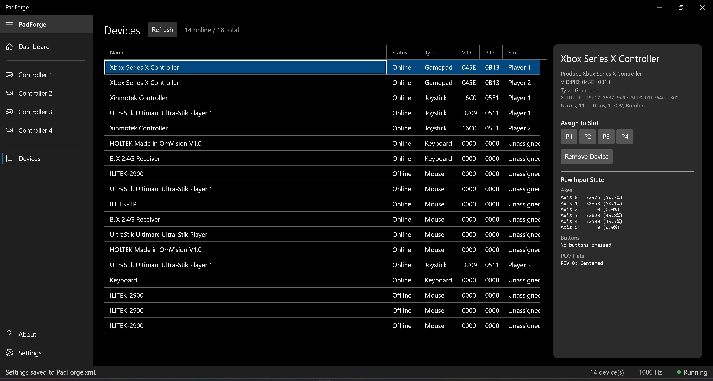
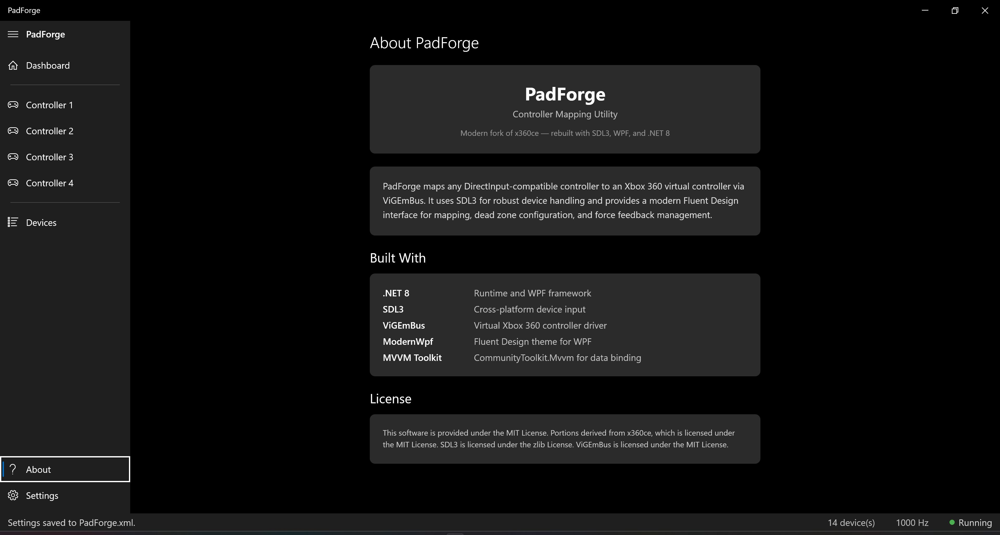
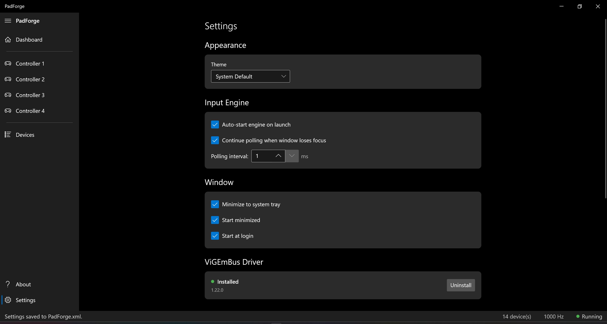
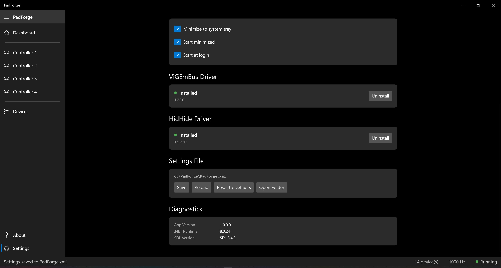

# PadForge

Modern controller mapping utility for Windows. Maps any controller, keyboard, or mouse to a virtual Xbox 360 controller via ViGEmBus. SDL3 handles device detection across all backends (XInput, HID, and more).

Built with SDL3, .NET 8 WPF, and Fluent Design. Modern fork of [x360ce](https://github.com/x360ce/x360ce).

## Features

- **Any device to Xbox 360** — Joysticks, gamepads, keyboards, and mice all map to virtual Xbox 360 controllers that games see as real hardware
- **4 virtual controller slots** — Each slot can combine input from multiple physical devices
- **Visual controller display** — Live Xbox Series controller diagram showing all mapped inputs in real time
- **Interactive mapping** — Record mappings by pressing buttons on your controller, or use "Map All" for quick setup. Auto-mapping for recognized gamepads
- **Dead zones and response curves** — Per-axis dead zone, anti-dead zone, and linear response curve for sticks and triggers, with live preview
- **Force feedback** — Rumble passthrough with per-motor strength, overall gain, and motor swap
- **Macro system** — Trigger combos that execute button presses, key presses, delays, and axis manipulation with repeat modes
- **Driver management** — One-click install/uninstall for ViGEmBus and HidHide
- **System tray** — Minimize to tray, start minimized, start at login
- **Portable** — Single-file self-contained executable via `dotnet publish`

## Screenshots

### Dashboard

At-a-glance overview showing input engine status (polling rate, device count), the state of all four virtual controller slots, and installed driver versions for ViGEmBus and HidHide.

### Controller Visualization

Live Xbox Series controller diagram that highlights buttons, sticks, and triggers as you press them. Includes real-time motor activity meters and a "Map All" button for quick auto-mapping.

### Button and Axis Mappings

Full mapping grid where each Xbox output (buttons, sticks, triggers, D-pad) can be assigned to any source input. Record a mapping by pressing a button on your device, or edit the descriptor directly. Supports inversion and half-axis options.

### Left Stick Dead Zones

Per-axis dead zone and anti-dead zone sliders for the left stick, with a live circular preview that shows the current stick position and the active dead zone region.

### Right Stick Dead Zones

Same dead zone and anti-dead zone configuration for the right stick, with its own independent live preview.

### Trigger Dead Zones

Dead zone and anti-dead zone sliders for left and right triggers. Live value bars show the raw and processed trigger output side by side.

### Force Feedback / Rumble

Rumble configuration with overall gain, per-motor strength sliders, and a swap option. Test Rumble button for quick verification, plus live motor activity bars showing current rumble intensity.

### Macro Editor

Create macros triggered by button combinations. Each macro supports an action sequence of button presses, key presses, and delays. Configurable fire mode (on press, on release, repeat) with full key combo builder.

### Device List

All detected devices — gamepads, joysticks, keyboards, and mice — with status, type, VID/PID, and slot assignment. Select a device to see its raw input state (axes, buttons, POV hats) and assign it to any controller slot.

### About

Application information, technology stack, and license details.

### Settings

Appearance theme, input engine options (auto-start, background polling, polling interval), and window behavior (system tray, start minimized, start at login).

### Settings — Drivers and Diagnostics

One-click ViGEmBus and HidHide driver management, settings file controls (save, reload, reset, open folder), and diagnostics showing app version, .NET runtime, and SDL version.

## Requirements

- Windows 10 or 11 (x64)
- [ViGEmBus driver](https://github.com/nefarius/ViGEmBus/releases) — for virtual controller output (PadForge can install this for you)
- [SDL3.dll](https://github.com/libsdl-org/SDL/releases) — place in the output directory next to the exe (included in the build output if present at `Resources/SDL3/x64/SDL3.dll`)

## Build

```bash
dotnet restore PadForge.sln
dotnet build PadForge.sln -c Release
```

### Publish as single portable executable

```bash
dotnet publish PadForge.App/PadForge.App.csproj -c Release
```

Output: `PadForge.App/bin/Release/net8.0-windows/win-x64/publish/PadForge.exe`

## Project Structure

```
PadForge.sln
├── PadForge.Engine/          .NET 8 class library — device wrappers, input state, data models
│   ├── Common/
│   │   ├── SDL3Minimal.cs           SDL3 P/Invoke (joystick, keyboard, mouse)
│   │   ├── ISdlInputDevice.cs       Common interface for all device wrappers
│   │   ├── SdlDeviceWrapper.cs      Joystick/gamepad wrapper
│   │   ├── SdlKeyboardWrapper.cs    Keyboard wrapper
│   │   ├── SdlMouseWrapper.cs       Mouse wrapper
│   │   ├── CustomInputState.cs      Unified input state (axes, buttons, POVs, sliders)
│   │   └── ForceFeedbackState.cs    Rumble state management
│   └── Data/
│       ├── UserDevice.cs            Physical device record
│       ├── UserSetting.cs           Device-to-slot assignment
│       └── PadSetting.cs            Mapping configuration
│
└── PadForge.App/             .NET 8 WPF application
    ├── Common/Input/
    │   ├── InputManager.cs              Background polling thread (~1000 Hz)
    │   ├── InputManager.Step1.*.cs      Device enumeration (SDL joysticks, keyboards, mice)
    │   ├── InputManager.Step2.*.cs      State reading + force feedback
    │   ├── InputManager.Step3.*.cs      Input state → Xbox gamepad mapping
    │   ├── InputManager.Step4.*.cs      Multi-device combination per slot
    │   ├── InputManager.Step5.*.cs      ViGEm virtual controller output
    │   └── InputManager.Step6.*.cs      XInput readback for UI display
    ├── Views/                           Dashboard, Controller (x4), Devices, Settings, About
    ├── ViewModels/                      MVVM view models
    └── Services/                        InputService, SettingsService, DeviceService, RecorderService
```

## Architecture

PadForge runs a 6-step input pipeline on a background thread at ~1000 Hz:

1. **Enumerate** — Discover joysticks, keyboards, and mice via SDL3; filter ViGEm virtual controllers
2. **Read** — Poll input state from all online devices; apply force feedback
3. **Map** — Convert `CustomInputState` to Xbox gamepad state using mapping descriptors
4. **Combine** — Merge multiple devices per virtual controller slot
5. **Output** — Feed combined state to ViGEm virtual Xbox 360 controllers
6. **Readback** — Read XInput state back for UI visualization

All device types share the `ISdlInputDevice` interface and produce `CustomInputState`, so the mapping pipeline works identically for joysticks, keyboards, and mice.

## Technologies

| | |
|---|---|
| .NET 8 | Runtime and WPF framework |
| SDL3 | Device input (joysticks, keyboards, mice) |
| ViGEmBus | Virtual Xbox 360 controller driver |
| ModernWpf | Fluent Design theme for WPF |
| CommunityToolkit.Mvvm | MVVM data binding |

## License

MIT License. Portions derived from x360ce (MIT). SDL3 is licensed under the zlib License. ViGEmBus is licensed under the MIT License.
